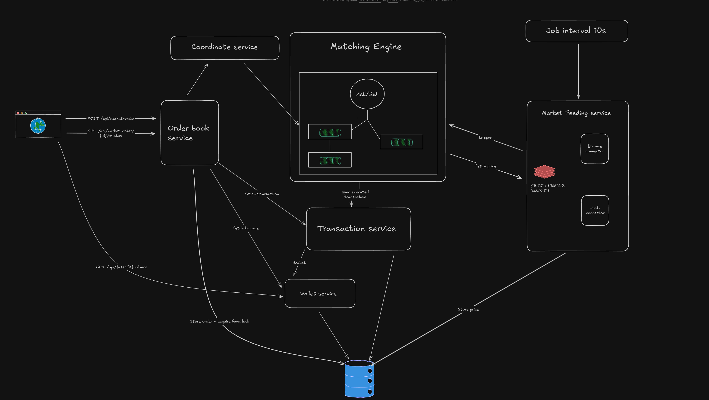
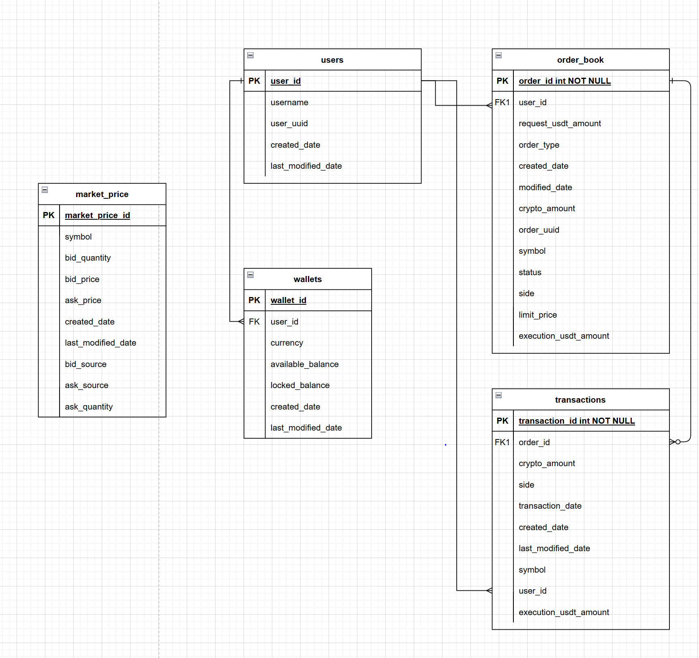

# Trading System

### 1. The requirements

#### 1.1 Description

Develop a crypto trading system with SpringBoot framework and in memory H2

#### 1.2. Functional scope

   1. User able to buy/sell the supported crypto trading pairs
   2. User able to see the list of trading transactions
   3. User able to see the crypto currencies wallet balance

#### 1.3. Assumption

- User has already authenticated and authorised to access the APIs
- User's initial wallet balance 50,000 USDT in DB record.
- Only support Ethereum - ETHUSDT and Bitcoin - BTCUSDT pairs of crypto trading.
- User will trade based on the best aggregated price provided by the market feeding.
    -> We would compare bid/ask price between Huobi and Binance platform to get best aggregated price

### 2. System design

#### 2.1 High level design

- The order must follow FIFO rule - which mean the first order will be executed first
- When the order come and the order queue is empty, the order must be executed immediately
- When user place an order but the quantity is not enough, it will be reversed

##### 2.1.1 Order Book

##### 2.1.2 Matching Engine

#### 2.2 Database design

2.3 Low level design